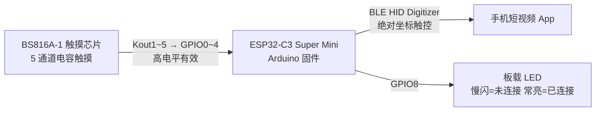
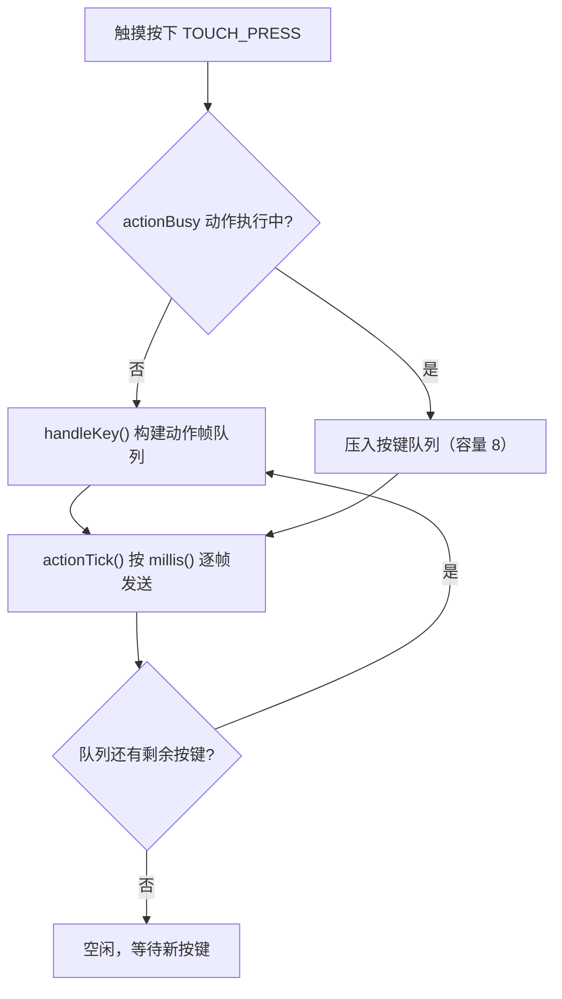
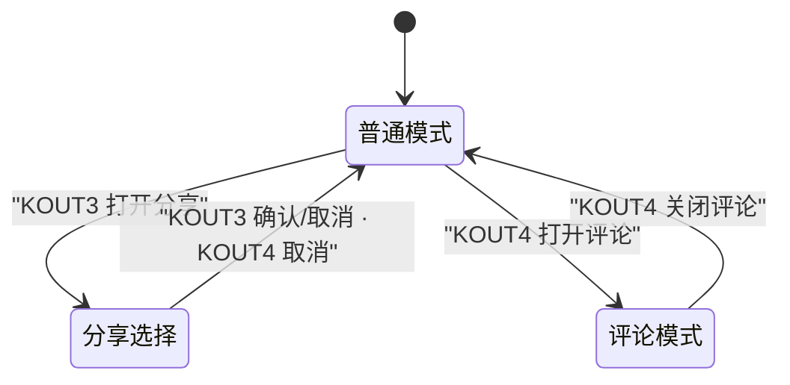

<p align="center">
  
</p>

<h1 align="center">刷抖音神器 · DY</h1>
<p align="center">基于 ESP32-C3 的 BLE 触控遥控器（HID Digitizer）</p>

<p align="center">
  
  
  
  
  
</p>

> 通过 **NimBLE HID Digitizer（绝对坐标触摸屏）** 模拟手指触摸手势，免 Root、免安装 App，让手机把本设备当作一块外接触摸屏。上键/下键刷视频，还能点赞、评论、选择好友分享。

---

## 目录

- [功能特性](#功能特性)
- [硬件设计](#硬件设计)
- [核心设计](#核心设计)
- [编译与烧录](#编译与烧录)
- [使用说明](#使用说明)
- [配置说明](#配置说明)
- [目录结构](#目录结构)
- [常见问题](#常见问题)
- [Roadmap](#roadmap)
- [免责声明](#免责声明)

---

## 功能特性

- 🎯 **免 Root / 免安装 App**：手机把它当作普通 HID 触控设备，即连即用
- 🔼🔽 **上下滑切换视频**：上键 = 上一个，下键 = 下一个
- ❤️ **单击点赞**、💬 打开/关闭评论区、🔗 循环选择好友分享
- 🖱️ **绝对坐标触控**：X/Y 各自独立的 Logical Max，严格匹配屏幕宽高比，避免横向压缩
- ⚡ **全流程无阻塞**：动作被拆成「帧队列」由 `millis()` 驱动，绝不卡死主循环
- 🚀 **按键不丢失**：动作执行期间仍持续轮询按键并压入队列，快速连点逐个执行
- 🌊 **丝滑缓动**：悬停移动使用指数缓出（ease-out expo），「跨环跳回」另有专属更强参数
- 🛡️ **上电/连接防误触发**：触摸驱动首次读取建立基准 + 20ms 消抖

---

## 硬件设计

### 物料清单（BOM）

| 名称 | 型号 / 说明 | 数量 |
|------|------------|------|
| 主控 | ESP32-C3 Super Mini | 1 |
| 触摸芯片 | Holtek BS816A-1（6 键，本项目使用 5 键） | 1 |
| 供电 | 5V2A充放电一体模块 | 1 |
| 电源 | 602532锂电池 | 1 |

### 引脚映射

| 功能 | 引脚 | 说明 |
|------|------|------|
| 上键 `KOUT1` | `GPIO0` | 下滑（上一个视频） |
| 下键 `KOUT2` | `GPIO1` | 上滑（下一个视频） |
| 分享键 `KOUT3` | `GPIO2` | 打开分享面板 |
| 评论键 `KOUT4` | `GPIO3` | 打开评论区 |
| 点赞键 `KOUT5` | `GPIO4` | 点赞 |
| 板载 LED | `GPIO8` | 慢闪 = 未连接，常亮 = 已连接 |

### BS816A-1 接线

| 引脚 | 接法 | 说明 |
|------|------|------|
| `VDD` | `3.3V` | 供电（与 ESP32-C3 GPIO 电平匹配） |
| `VSS` | `GND` | 地 |
| `OMS` | `GND` | CMOS 直接输出，**高电平有效** |
| `LSC` | 悬空（开路） | 一般省电模式，待机响应更快 |
| `Key1~Key5` | 触摸焊盘 | 5 个触摸按键 |
| `Key6` | `GND` | **未使用的按键必须接地** |
| `Kout1~Kout5` | `GPIO0~4` | 5 路输出 → ESP32-C3 输入 |

### 连接示意



> 引脚定义集中在 [touch.ino](touch.ino#L19-L25)。

---

## 核心设计

### 整体架构

固件分为四层，各层职责单一、彼此解耦：

| 层 | 文件 | 职责 |
|----|------|------|
| 触摸驱动 | `BS816A.h/.cpp` | GPIO 读取、20ms 消抖、按下/释放边沿检测 |
| 配置层 | `Config.h` | 所有坐标与触控参数集中管理（编译期常量） |
| 动作执行器 | `touch.ino` | 把点击/滑动/悬停拆成帧队列，非阻塞逐帧发送 |
| BLE 传输 | `touch.ino` | NimBLE HID Digitizer 建链、上报触摸报告 |

### 为什么用 HID Digitizer，而不是键盘/鼠标？

短视频 App 的「上滑/下滑」不是标准按键，普通 BLE HID 键盘发不了；而 **Digitizer（数字化触摸屏）** 是 HID 标准里描述「绝对坐标触摸」的用法，Android/iOS 原生支持。设备上报 `(Tip Switch, In Range, X, Y)`，系统就会把它当作一次真实的触摸/悬停事件注入，App 完全无感。

### HID Report Map 解析

上报报告固定为 **5 字节**，Report ID = `0x01`：

| 字节 | 内容 |
|------|------|
| `0` | `Bit0` = Tip Switch（按下），`Bit1` = In Range（悬停），`Bit2~7` = 填充 |
| `1~2` | X 逻辑坐标（16-bit 小端，`0~4500`） |
| `3~4` | Y 逻辑坐标（16-bit 小端，`0~10000`） |

Report Map 关键字段：

| 字段 | 值 | 说明 |
|------|----|------|
| Usage Page | `0x0D` | Digitizer |
| Usage | `0x04` | Touch Screen |
| Report ID | `0x01` | 输入报告 |
| Tip Switch | 1 bit | 手指按下 |
| In Range | 1 bit | 指针在有效范围内（悬停） |
| X | 16 bit，Logical Max `4500` | 对应屏幕宽 |
| Y | 16 bit，Logical Max `10000` | 对应屏幕高 |

### 坐标映射：为什么 X 是 4500、Y 是 10000？

标定屏幕为 `1080 × 2400`，为了让「1 个逻辑单位」在横纵两个方向对应**相同的物理距离**，X 的逻辑上限按宽高比折算：

```
LOGICAL_MAX_X = 10000 × 1080 / 2400 = 4500
```

这样发送任意坐标时，横向不会因为逻辑量程过小而被「拉伸」，手势比例与真实手指一致。映射函数：

```c
// px: 物理像素坐标；screenPx: 屏幕物理尺寸；logicalMax: 该轴逻辑上限
v = px * logicalMax / screenPx;   // 再 clamp 到 [0, logicalMax]
```

X、Y 的 Logical Max 由 `Config::logical_max_x/y` 生成并注入 Report Map，**单一事实来源**，改配置不会导致描述符与坐标映射脱节。

### 悬停（不点击）的实现

`Tip Switch = 0` 且 `In Range = 1` 时，指针处于「抬起但未离开屏幕」的悬停态，可自由移动而不触发点击。项目借此实现：

- 滑动结束后**悬停回到起点**，下次操作光标位置连续、不瞬移
- 分享状态下在头像间**平滑移动**，由点赞键决定是否真正点击

### 无阻塞动作执行器

所有动作（点击 / 滑动 / 悬停）被拆成若干「帧」，每帧包含坐标、Tip/In Range 状态、以及发送后的等待时长：

```c
struct ActionFrame {
  uint16_t px, py;   // 物理像素坐标
  bool tip;          // 是否按下
  bool inRange;      // 是否悬停
  uint16_t waitMs;   // 本帧发送后等待的毫秒数
};
#define ACTION_MAX_FRAMES 220   // 单次动作最多 220 帧
```

主循环里的 `actionTick()` 用 `millis()` 判断到点发送下一帧，全程不 `delay()`。以「上滑」为例的动作拆解：

```
按住 60ms → 50 帧插值滑到终点(每帧 4ms) → 抬起(保持悬停)
→ 50 帧悬停回起点 → 离开屏幕
```

### 按键队列：动作期间按键不丢失

早期版本在动作执行期间直接忽略新按键，快速连点会「吞键」。现在改为：



关键点：**动作执行期间仍持续轮询触摸芯片**（否则短暂按下会被消抖层错过），捕获到的按键先入 FIFO 队列，动作结束后依次弹出执行。连点 8 次以内都能不丢、按顺序播放。

### 三态状态机

同一批按键在不同模式下语义不同，由 `shareMode` / `commentMode` 两个标志构成状态机：



| 按键 | 普通模式 | 分享选择 | 评论模式 |
|------|----------|----------|----------|
| `KOUT1` 上键 | 下滑（上一个） | 上一个头像 | 下滑评论 |
| `KOUT2` 下键 | 上滑（下一个） | 下一个头像 | 上滑评论 |
| `KOUT3` 分享键 | 打开分享面板 | 确认 / 中断分享 | 无效 |
| `KOUT4` 评论键 | 打开评论区 | 取消分享 | 关闭评论区 |
| `KOUT5` 点赞键 | 点赞 | 选中 / 取消头像 | 无效 |

### 缓动曲线：指数缓出（ease-out expo）

悬停移动使用 **easeOutExpo** 曲线，让光标「先极快、后极慢」地丝滑滑入：

```
e(t) = 1 - 2^(-k·t)
```

其中 `k` 越大，前段越快、尾段越慢。针对「跨环跳回」（从第 5 个头像跳回第 1 个，横向跨度 768px）使用**专属更强参数**，轨迹更细腻：

| 参数 | 普通相邻移动 | 跨环跳回 |
|------|-------------|----------|
| 步数 | 60 | 96 |
| 起始延时 | 2 ms | 1 ms |
| 结束延时 | 26 ms | 30 ms |
| 缓动强度 `k` | 8.0 | 12.0 |

> 缓动只在「动作构建」时一次性计算中间点（非逐帧热路径），浮点开销可忽略。相关参数见 `Config.h` 的 `hover_*` / `hover_jump_*`。

### 触摸检测与消抖

- BS816A-1 为 CMOS 高电平有效输出，ESP32-C3 浮空输入读取
- 驱动层 20ms 消抖，避免抖动误触发
- 首次读取建立基准，避免上电 / BLE 连接时芯片未稳定导致误触发
- 只判断短按，无长按逻辑

---

## 编译与烧录

### 环境要求

| 组件 | 版本 / 说明 |
|------|------------|
| Arduino IDE | 2.x |
| ESP32 核心 | `esp32` by Espressif（`3.x`，实测 `3.3.11`） |
| 库 | [NimBLE-Arduino](https://github.com/h2zero/NimBLE-Arduino) |

### 步骤

1. Arduino IDE 打开 `touch.ino`
2. 添加开发板管理器地址：`https://espressif.github.io/arduino-esp32/package_esp32_index.json`
3. 安装 `esp32` 核心，并在库管理器安装 **NimBLE-Arduino**（作者 h2zero）
4. 开发板选择 `ESP32C3 Dev Module`（或 `ESP32-C3 Super Mini`）
5. 选择串口，点击上传

烧录完成后设备以广播名 **`DY`** 出现在手机蓝牙列表，连接无需配对码。

---

## 使用说明

### 分享流程

1. 普通模式按 **分享键** → 点击分享按钮，打开面板，自动悬停到**第一个头像**（不点击）
2. 按 **上键 / 下键** → 在 5 个头像间循环切换（悬停移动，不点击）
3. 按 **点赞键** → 点击当前头像，切换选中 / 取消
4. 再次按 **分享键**：
   - 已选过头像 → 点击确认分享按钮，完成分享
   - 未选任何头像 → 中断分享，关闭面板
5. 中途按 **评论键** → 点击面板外区域，随时取消分享

### 评论流程

1. 普通模式按 **评论键** → 打开评论区，进入评论状态
2. 评论状态下按 **上键 / 下键** → 正常滑动评论列表
3. 再次按 **评论键** → 关闭评论区，退出评论状态

---

## 配置说明

所有坐标与触控参数集中在 [Config.h](Config.h)，为**编译期常量**（固定 1080×2400 标定，无串口运行时配置）。

### 关键坐标

| 常量 | 值 | 用途 |
|------|----|------|
| `anchor_x/y` | (993, 1535) | 操作后光标返回的锚点 |
| `comment_x/y` | (1002, 1605) | 评论按钮 |
| `comment_close_x/y` | (540, 726) | 关闭评论区点击点 |
| `share_x/y` | (1002, 1960) | 分享按钮 |
| `share_cancel_x/y` | (1003, 1700) | 取消 / 关闭分享面板 |
| `avatar_y` | 1902 | 好友头像纵坐标 |
| `avatar_x[]` | {116, 308, 500, 692, 884} | 5 个头像横坐标 |
| `confirm_share_x/y` | (815, 2321) | 确认分享按钮 |
| `like_x/y` | (1002, 1426) | 点赞位置 |

### 触控参数

| 常量 | 默认值 | 说明 |
|------|--------|------|
| `screen_width / height` | 1080 / 2400 | 标定屏幕分辨率 |
| `logical_max_x / y` | 4500 / 10000 | HID 逻辑坐标上限 |
| `swipe_distance_px` | 150 | 滑动距离（像素） |
| `swipe_steps` | 50 | 滑动插值步数 |
| `swipe_step_ms` | 4 | 滑动每步延时 |
| `tap_down_ms` | 14 | 点击按下时长 |
| `hover_steps` | 60 | 普通悬停步数 |
| `hover_delay_min / max` | 2 / 26 | 普通悬停延时范围 |
| `hover_ease_k` | 8.0 | 普通悬停缓动强度 |
| `hover_jump_steps` | 96 | 跨环跳回步数 |
| `hover_jump_delay_min / max` | 1 / 30 | 跳回延时范围 |
| `hover_jump_ease_k` | 12.0 | 跳回缓动强度 |

> 换手机 / 改分辨率时，只需修改 `Config.h` 中的坐标常量后重新编译，无需改动逻辑代码。

---

## 目录结构

```
touch/
├── touch.ino       # 主程序：BLE/HID、动作帧执行器、按键队列、状态机、缓动曲线
├── BS816A.h        # 触摸芯片驱动头文件（引脚、消抖参数）
├── BS816A.cpp      # 触摸芯片驱动实现（读取、消抖、边沿检测）
├── Config.h        # 集中式坐标与触控参数常量
└── build/          # Arduino 编译产物（建议加入 .gitignore）
```

---

## 常见问题

<details>
<summary>🔹 手机搜不到设备？</summary>

确认广播名是 `DY`，并检查 LED：慢闪说明正在广播。若已连接过，先「忽略/忘记」该设备再重搜。
</details>

<details>
<summary>🔹 能连上但操作没反应 / 位置错位？</summary>

坐标是基于 `1080×2400` 分辨率 + 特定 App 版本实测标定的。若机型或 App 布局不同，请修改 `Config.h` 中的坐标常量后重新编译。
</details>

<details>
<summary>🔹 滑动方向反了？</summary>

「上键 = 下滑（上一个）」「下键 = 上滑（下一个）」对应短视频 App 的默认手势语义。若你的 App 语义相反，交换 `handleKey()` 中 `case 0` / `case 1` 的 `+/- swipe_distance_px` 即可。
</details>

<details>
<summary>🔹 分享面板位置 / 头像坐标怎么标定？</summary>

开启系统「指针位置」开发者选项，或抓取截图量像素坐标，填入 `Config.h`。头像横向坐标固定为 5 等分点即可微调。
</details>

---

## Roadmap

- [ ] 增加低功耗休眠（长时间未操作自动 sleep）
- [ ] 支持多套坐标配置（针对不同机型/App 快速切换）
- [ ] 自动连刷模式（连点多次的替代实现）
- [ ] 补充硬件 PCB / 外壳设计文件

---

## 免责声明

本项目仅供学习交流，请勿用于任何违反平台服务条款或侵犯他人权益的行为。使用本设备产生的一切后果由使用者自行承担。

> License：暂未指定，如有需要可选用 MIT 等宽松许可后补充 `LICENSE` 文件。
